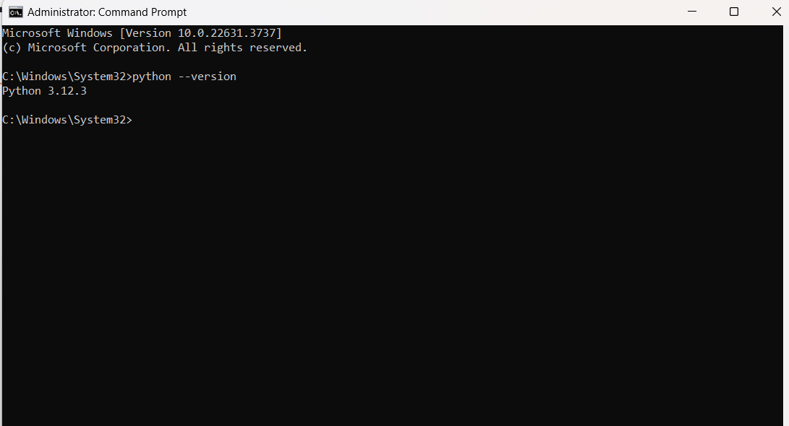

# Dev_Setup
Setup Development Environment

#Assignment: Setting Up Your Developer Environment

#Objective:
This assignment aims to familiarize you with the tools and configurations necessary to set up an efficient developer environment for software engineering projects. Completing this assignment will give you the skills required to set up a robust and productive workspace conducive to coding, debugging, version control, and collaboration.

#Tasks:

1. Select Your Operating System (OS):
   Choose an operating system that best suits your preferences and project requirements. Download and Install Windows 11. https://www.microsoft.com/software-download/windows11

   

2. Install a Text Editor or Integrated Development Environment (IDE):
   Select and install a text editor or IDE suitable for your programming languages and workflow. Download and Install Visual Studio Code. https://code.visualstudio.com/Download

   

3. Set Up Version Control System:
   Install Git and configure it on your local machine. Create a GitHub account for hosting your repositories. Initialize a Git repository for your project and make your first commit. https://github.com

   

4. Install Necessary Programming Languages and Runtimes:
  Instal Python from http://wwww.python.org programming language required for your project and install their respective compilers, interpreters, or runtimes. Ensure you have the necessary tools to build and execute your code.

  

5. Install Package Managers:
   If applicable, install package managers like pip (Python).

   

6. Configure a Database (MySQL):
   Download and install MySQL database. https://dev.mysql.com/downloads/windows/installer/5.7.html

   

7. Set Up Development Environments and Virtualization (Optional):
   Consider using virtualization tools like Docker or virtual machines to isolate project dependencies and ensure consistent environments across different machines.

   

8. Explore Extensions and Plugins:
   Explore available extensions, plugins, and add-ons for your chosen text editor or IDE to enhance functionality, such as syntax highlighting, linting, code formatting, and version control integration.
   
   
   

9. Document Your Setup:
    Create a comprehensive document outlining the steps you've taken to set up your developer environment. Include any configurations, customizations, or troubleshooting steps encountered during the process. 
1. Operating System (OS):
   Step 1 - Download Windows 11 OS from https://www.microsoft.com/software-download/windows11
   Step 2 - Format the drive and set the primary partition as active.

   Connect the USB flash drive to your technician PC.
   Open Disk Management: Right-click on Start and choose Disk Management.
   Format the partition: Right-click the USB drive partition and choose Format. Select the FAT32 file system to be able to boot either BIOS-based or UEFI-based PCs.
   Set the partition as active: Right-click the USB drive partition and click Mark Partition as Active.

   Step 3 - Copy Windows Setup to the USB flash drive.

   Use File Explorer to copy and paste the entire contents of the Windows product DVD or ISO to the USB flash drive.
   Optional: add an unattend file to automate the installation process. For more information, see Automate Windows Setup.

   Step 4 - Install Windows to the new PC.

   Connect the USB flash drive to a new PC.
   Turn on the PC and press the key that opens the boot-device selection menu for the computer, such as the Esc/F10/F12 keys. Select the option that boots the PC from the USB flash drive.
   Windows Setup starts. Follow the instructions to install Windows.
   Remove the USB flash drive.

2. Install a Text Editor or Integrated Development Environment (IDE):
   Step 1 - Doownlound Visual Studio Code from https://code.visualstudio.com/Download

   Step 2 -  Install: Click the "Install" button to start the installation process.
   This may take some time, as it involves downloading and installing the selected components.
   Step 3 - Launch Visual Studio: Once the installation is complete, launch Visual Studio. Sign in with your Microsoft account or create one if prompted.
   Step 4 - Choose Development Environment: On the welcome screen, select your development environment. For example, you can choose "Development Settings" based on your preferred coding style.
   Step 5 - Start Coding: You're now ready to start coding! Create a new project or open an existing one to begin your development work.

3. Setting Up Version Control System:
   Step 1 - visit https://github.com
   to create a GitHub account for hosting your repositories. Initialize a Git repository for your project and make your first commit. 

4. Installing Necessary Programming Languages and Runtimes like Python:
   Step 1 - Download and install Python from http://wwww.python.org 
   Step 2 - Launch Python: Once the installation is complete, launch Python.
   Step 3 - Locate where Python has been installed, and copy the path address
   Step 4 - Go to your Environment user variable and paste it there.
   Step 3 - Verify if Python has been installed correctly by opening your command terminal and run: python --version command

5. Install Package Managers:
   Step 1 - Go to your terminal and run; python get-pip.py command
   Step 2 - run pip --version command to verify

6.  Configure a Database (MySQL):
   Step 1 - Download and install MySQL database from https://dev.mysql.com/downloads/windows/installer/5.7.html
   Step 2 - follow the installation prompts, create root password
   Step 3 - Follow the step to install MySQL workbench
   Step 4 - Copy to Environment user variable path
   Step 4 - Run; mysql -u root -p command to verify if it has been properly installed
   Step 5 - Run; show databases command to view database

7. Virtual environment for my Django projects:
   Step 1 - Go to gitBash
   Step 2 - Make a directory; with Mkdir "directory_name" command, and cd into it.
   Step 3 - Run python -m pip install virtualenv commant to create virtual environment for the folder
   Step 4 - Run python -m virtualenv --version command to verify
   Step 5 - Run python -m virtualenv "your virtual environment_name", command to create a virtual environment for the Django project

8. Explore Extensions and Plugins:
   

#Deliverables:
- Document detailing the setup process with step-by-step instructions and screenshots where necessary.
- A GitHub repository containing a sample project initialized with Git and any necessary configuration files (e.g., .gitignore).

https://github.com/codawise-onyekachi/Ecommerce_with_Django.git

- A reflection on the challenges faced during setup and strategies employed to overcome them.

#Submission:
Submit your document and GitHub repository link through the designated platform or email to the instructor by the specified deadline.

#Evaluation Criteria:**
- Completeness and accuracy of setup documentation.
- Effectiveness of version control implementation.
- Appropriateness of tools selected for the project requirements.
- Clarity of reflection on challenges and solutions encountered.
- Adherence to submission guidelines and deadlines.

Note: Feel free to reach out for clarification or assistance with any aspect of the assignment.
